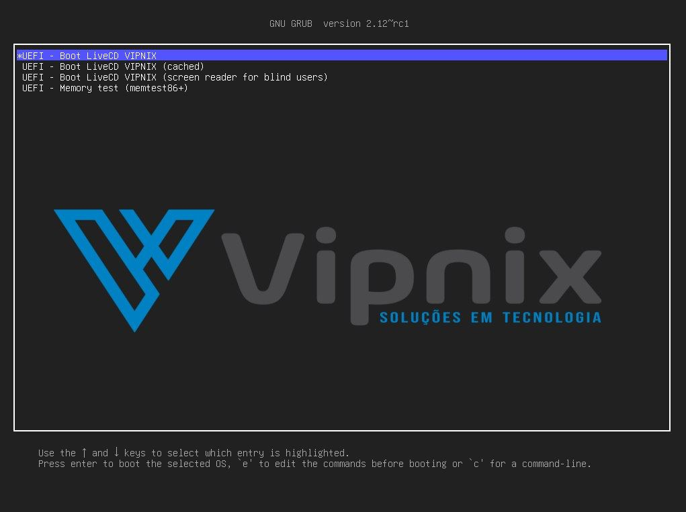
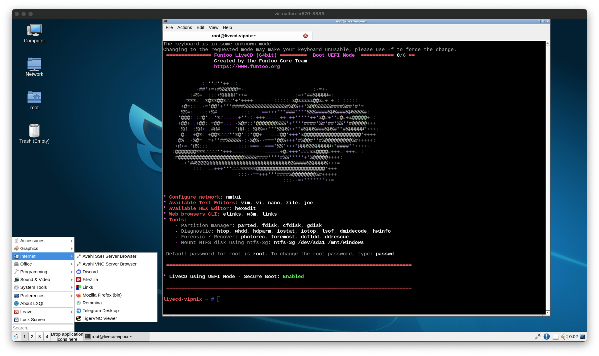

VIPNIX LiveCD

Based on [Funtoo Linux](https://funtoo.org/), with LXQT 1.4.0

**Download Link:** <https://area31.host.funtoo.org/vipnix-livecd-20240113-2047.iso>

**MD5:** 0b7a0a907b0b7242fa32144389a35ed0

**SHA256:** 779368939e6e08ac2edc9c0498860e61e922d5a70c2fca26d022c93d713c1531

type "**startx**" and have a lot of fun 😄

We are excited to introduce the latest innovation from Vipnix: our new Linux LiveCD, a distribution made for enthusiasts, professionals, and anyone who wants to experience the freedom and flexibility that only open-source software can offer. Without further ado and before going into details, here is the download link. Remember to always check the file's integrity:"

more infos: <https://vipnix.com.br/site/livecd-vipnix/>

Screenshots:

