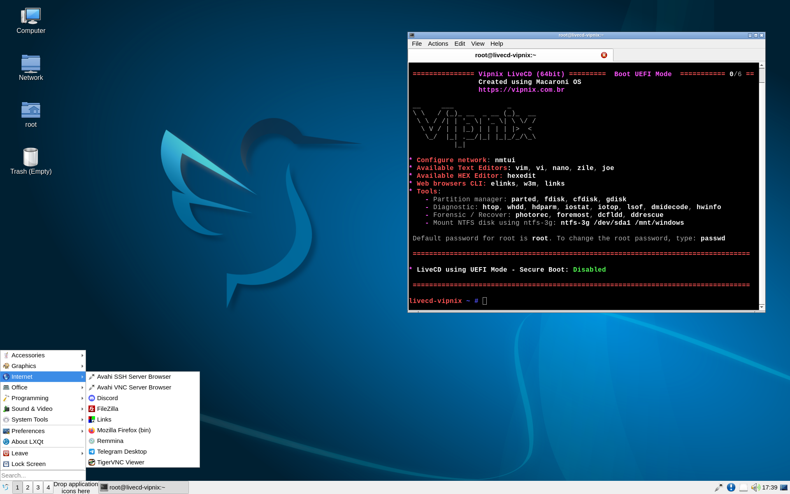

VIPNIX LiveCD

Based on [Macaroni OS](https://www.macaronios.org), with LXQT 1.4.0 + [XLIBRE](https://github.com/X11Libre/xserver)

**Download Link:** <https://vipnix.com.br/site/livecd-vipnix/>

type "**startx**" and have a lot of fun 😄

We are excited to introduce the latest innovation from Vipnix: our new Linux LiveCD, a distribution made for enthusiasts, professionals, and anyone who wants to experience the freedom and flexibility that only open-source software can offer. Without further ado and before going into details, here is the download link. Remember to always check the file's integrity (SHA256 or MD5):

Screenshots:




# Vipnix LiveCD Linux

Vipnix LiveCD is a portable, bootable Linux distribution built on the legacy of Gentoo, Funtoo, and Macaroni OS. It combines Gentoo's source-based optimization, Funtoo's innovative tools, and Macaroni OS's modern, container-friendly approach. Designed for enthusiasts, professionals, and system recovery, this LiveCD runs directly from a USB or DVD without installation.

## Origins and Heritage

### Gentoo Linux
Originally named *Enoch Linux* by Daniel Robbins in the early 2000s, Gentoo was developed to provide high-performance, hardware-optimized systems without precompiled binaries. Named after the swift Gentoo penguin, it introduced the EGCS compiler (later merged into GCC) and the modular Portage package manager, known for its flexibility and ease of maintenance.

### Funtoo Linux
Launched in 2008 by Robbins, Funtoo built on Gentoo's foundation, introducing Git-based Portage trees and tools like *metro* and *ego* to streamline user experience. Funtoo emphasized stable stage builds and modern package management. In August 2024, Robbins announced that Funtoo would transition to "hobby mode" with limited maintenance.

### Macaroni OS
Developed by Daniele Rondina, a former Sabayon Linux contributor, Macaroni OS started as a Funtoo-incubated project and became independent in 2023. It focuses on binary-based efficiency, supporting container-friendly builds with tools like *luet*, *MARK*, and *Anise*. Macaroni OS carries forward Funtoo's performance-driven philosophy with a modern approach.

## Vipnix LiveCD: A Fusion of Legacies

Vipnix LiveCD is based on Macaroni OS, with contributions from Vipnix and Funtoo developers. It integrates the lightweight LXQt desktop environment and the educational XLIBRE X-server, making it suitable for live use, system rescue, demonstrations, and on-the-go productivity.

- **Key Features**:
  - Runs directly from USB or DVD.
  - Optimized for performance and flexibility.
  - Open-source and freely distributable.

## About Vipnix

Founded in 2011, Vipnix is a Brazilian IT solutions company specializing in customized infrastructure, cybersecurity, data protection, and biotechnology. Committed to open-source development, Vipnix has contributed to several projects and communities, including:

- Translation of *SlackBook-ptBR*, the official Slackware Linux guide.
- Founding GUS-MG, the Slackware User Group of Minas Gerais.
- Participation in open-source events such as Oficina Livre II, Slackware Show Brasil, BHACK, and H2HC University.
- Contributions to *Slackware Zine* with technical articles.

Vipnix's founder, Raphael Bastos, is a co-founder of Área31 Hackerspace, a vibrant community hub for technology enthusiasts. Área31 fosters collaboration in 3D printing, cryptography, AI, cybersecurity, philosophy, and science. The hackerspace provides access to advanced tools and a network of like-minded individuals, encouraging innovation and skill development. It serves as a space for addressing environmental, social, and economic challenges through collaborative projects.

Vipnix actively supports the development and adoption of open-source systems like Funtoo Linux and Macaroni OS, contributing to their stability and feature enhancements. The company is dedicated to promoting open-source solutions and fostering a culture of collaboration within the Linux community.

## Quick Start

1. Boot the LiveCD from a USB or DVD.
2. At the console, type:
   ```bash
   startx
