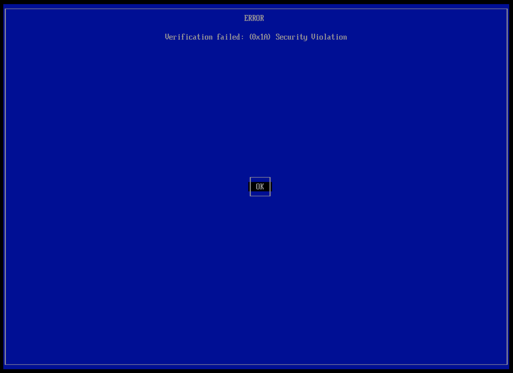
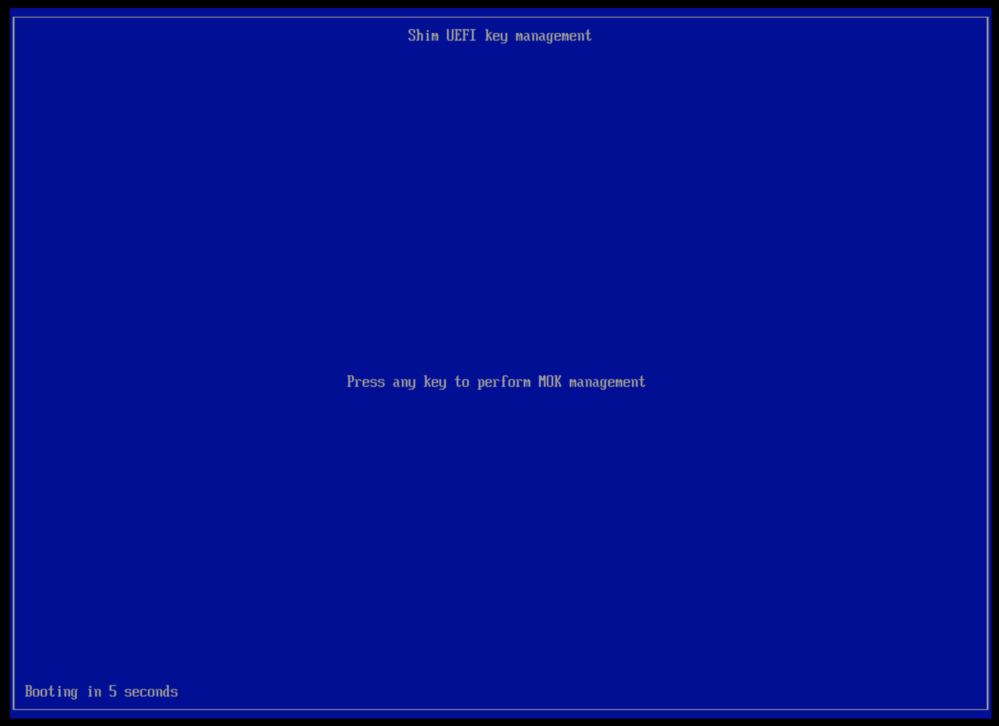
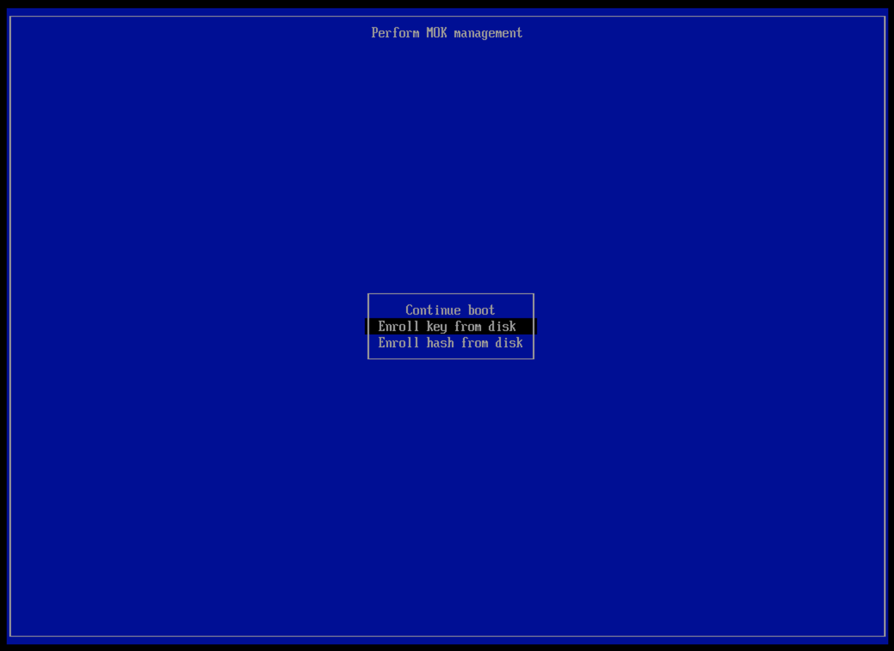
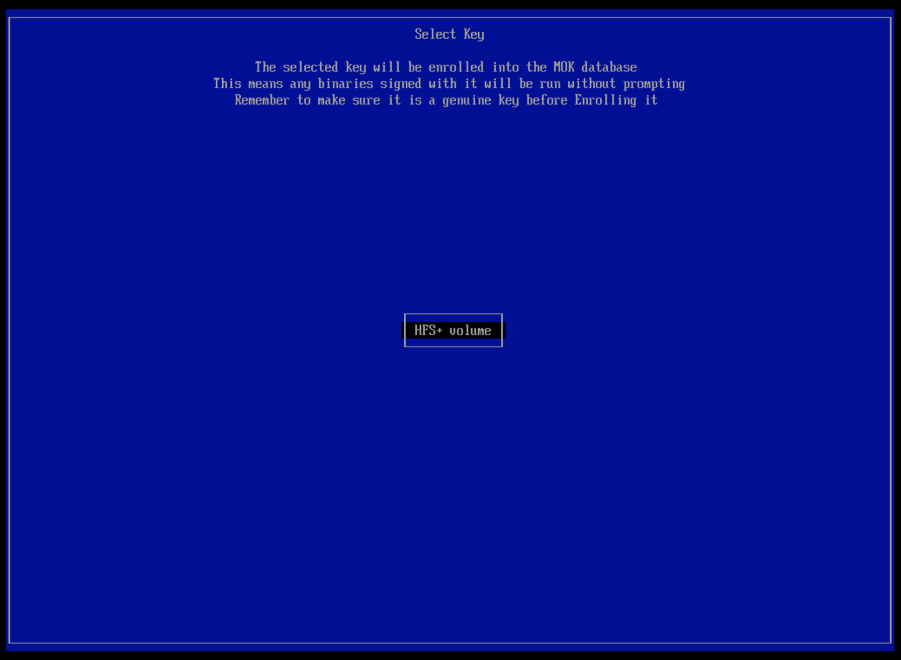
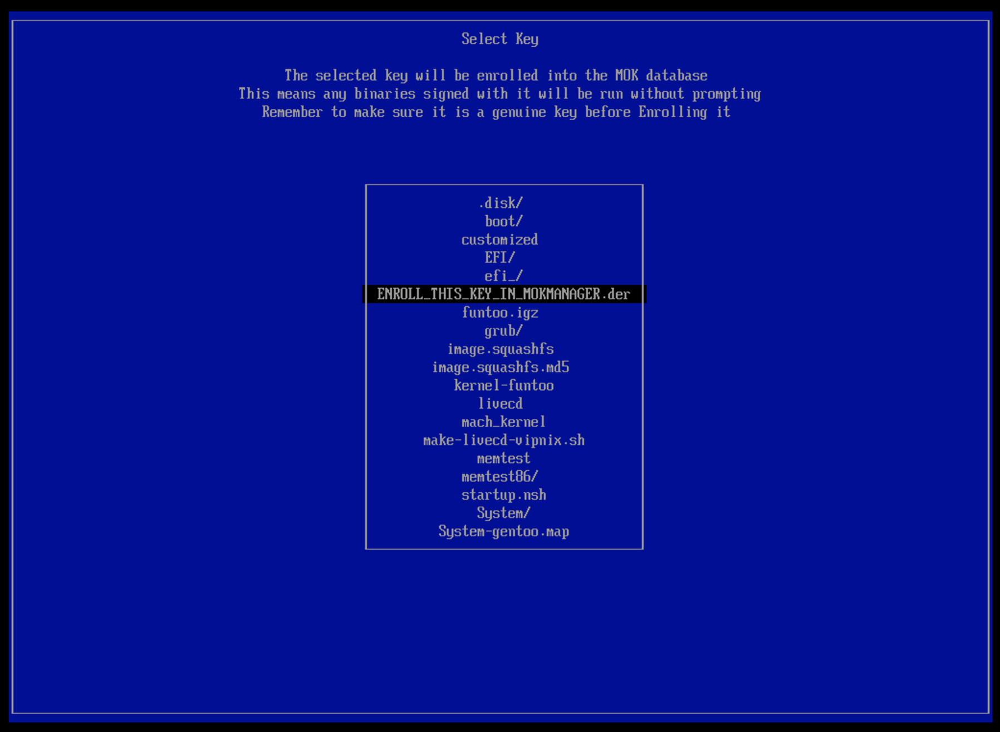
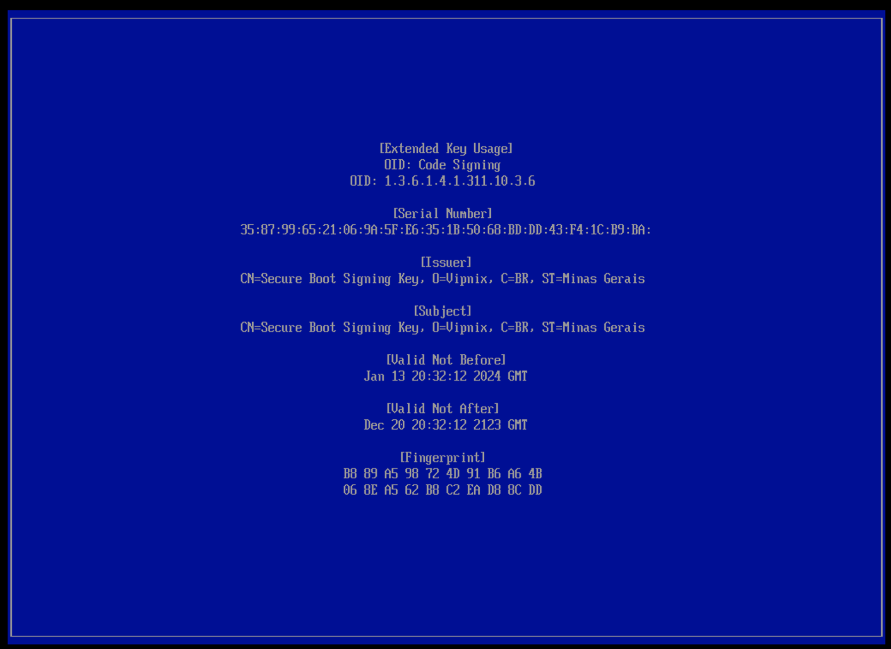
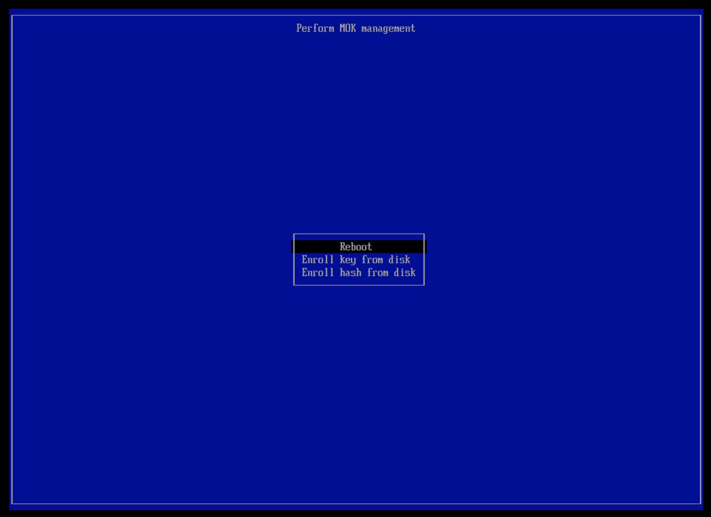

Troubleshooting Secure Boot Issues

To enable Secure Boot functionality, you may need to switch to the 'Other OS' mode in your BIOS settings. Alternatively, you can simply disable Secure Boot and start your system as usual.

During the first boot after system installation, some devices might display a 'MokManager' screen. This MOK (Machine Owner Key) management screen appears only once after making changes to a running system. If you do not register the MOK on the next boot, the key will be discarded, and you will need to restart the process from the beginning.

On this screen, press OK to enter the Shim UEFI Key Management:

Select 'Enroll key from disk' option:

Press ENTER on the 'HFS+ volume' disk:

Select the 'ENROLL_THIS_KEY_IN_MOKMANAGER.der' key and press ENTER:

Select the 'View Key 0' option and confirm if the 'Issuer' matches the following: 'CN=Secure Boot Signing Key, O=Vipnix, C=BR, ST=Minas Gerais':

If the key is the one from the previous step, press 'ENTER' and select the 'Continue' option:

Select the 'Yes' option on the 'Enroll the key(s)' screen:

Select the 'Reboot' option and start the system normally:

